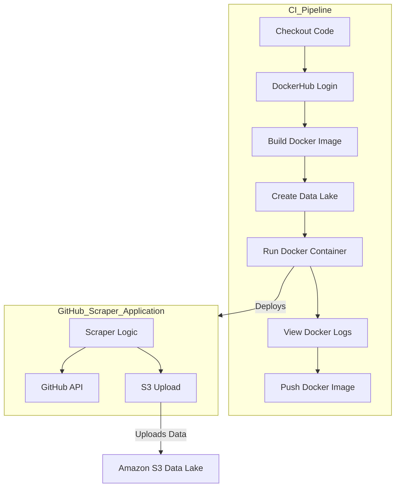

# Continuous Integration (CI) Pipeline:
Trigger: Initiated on pushes to the master branch or manually via workflow_dispatch.

Jobs:
- Checkout Code: Retrieves the latest code from the repository.
- DockerHub Login: Authenticates to DockerHub using stored secrets.
- Build Docker Image: Constructs a Docker image of the GitHub Scraper Application.
- Create Data Lake: Sets up a local directory named datalake (potentially for local storage or testing).
- Run Docker Container: Deploys the application container with environment variables specifying AWS S3 bucket details.
- View Docker Logs: Outputs logs from the running container for monitoring purposes.
- Push Docker Image: Uploads the newly built Docker image to DockerHub.

